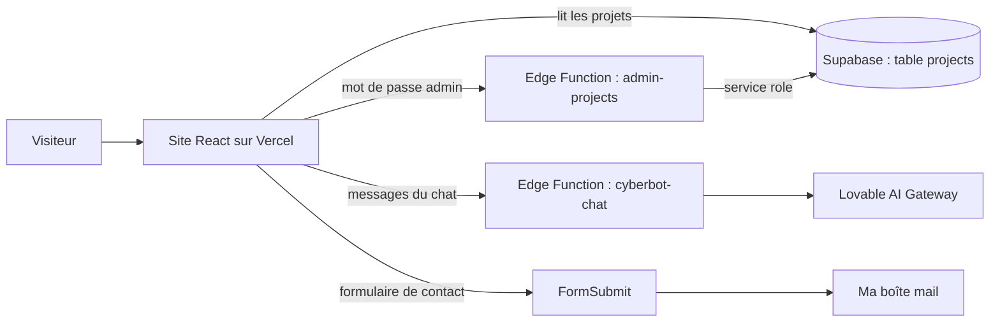

<div align="center">

# Florian G.L · Portfolio v2

**Mon portfolio personnel : projets, compétences, assistant IA et mini-jeux**

[🇬🇧 English](README.md) · 🇫🇷 Français

[](https://florian-portfolio-v2.vercel.app/)


</div>

---

## Présentation

Voici le code source de mon portfolio. Je suis étudiant en BUT Réseaux & Télécommunications, parcours cybersécurité, à La Réunion. Le site présente mes projets, mes compétences et mon CV, et propose aussi un assistant IA et quelques mini-jeux.

Voici la **version 2** : une refonte complète avec une planète 3D sur l'accueil, des animations soignées et une nouvelle identité visuelle. Tout le contenu de la [version précédente](https://github.com/JLFlo12/florian-portfolio) est conservé.

## Fonctionnalités

- 🪐 **Accueil** : présentation avec une planète 3D interactive (continents en points lumineux, liaisons réseau, anneau, balise sur La Réunion), compétences techniques et soft skills, et les outils que j'utilise (Kali Linux, Wireshark, GNS3, pfSense, Unreal Engine…) présentés sur une toile holographique 3D façon Jarvis, qu'on attrape et fait pivoter
- ✨ **Animations** : écran de chargement façon démarrage système, défilement fluide, titres qui apparaissent en 3D, transitions entre les pages, curseur personnalisé et détails façon HUD (désactivés si le système demande de réduire les animations)
- 📁 **Projets** : projets classés en *En cours* et *Terminés*, avec une page de détail pour chacun (description, galerie d'images, diaporama Canva)
- 👤 **À propos** : formation, domaines d'expertise (réseaux, systèmes, cybersécurité) et CV disponible en page web imprimable (`/cv`, une page A4) ou en PDF
- ✉️ **Contact** : un formulaire de contact (les messages arrivent par e-mail via FormSubmit, avec un piège anti-robots), ainsi que l'e-mail, GitHub et LinkedIn
- 🤖 **Jarvis** : un assistant IA qui répond aux questions sur mon profil, mes compétences et mes projets, mais aussi aux questions générales, avec des réponses affichées au fil de l'eau et mises en forme en Markdown. Il reste à jour : le site lui transmet la date du jour, les projets de la base et le profil affiché sur le site
- 🎮 **Jeux** : Dino Runner, Flappy Bird, Snake, Guess the Building et Tower Crane Challenge
- 🌗 **Thème sombre et clair**, mémorisé par le navigateur
- 🌍 **Français et anglais** (i18next)
- 🔐 **Mode admin** : un écran protégé par mot de passe pour ajouter, modifier et supprimer des projets et gérer leurs galeries, directement depuis le site

## Stack technique

| Domaine | Technologie |
| --- | --- |
| Framework | React 18 + TypeScript |
| Outil de build | Vite 5 (SWC) |
| Interface | Tailwind CSS, shadcn/ui (Radix UI), lucide-react |
| Animations | GSAP + ScrollTrigger, Lenis (défilement fluide), Framer Motion (mini-jeux) |
| 3D | three.js + React Three Fiber (planète de l'accueil, chargée à la demande) |
| Polices | Hubot Sans, Mona Sans, Geist Mono, Doto, Instrument Serif (hébergées dans `public/fonts`, licence SIL Open Font License) |
| Routage | React Router 6 |
| Traductions | i18next / react-i18next |
| Données | Supabase (PostgreSQL, Storage, Edge Functions) + TanStack React Query |
| Chatbot IA | Edge Function Supabase → Lovable AI Gateway (streaming) |
| Formulaire de contact | [FormSubmit](https://formsubmit.co) |
| Hébergement | Vercel |
| Statistiques | Vercel Web Analytics (sans cookies) |
| Génération initiale | [Lovable](https://lovable.dev) |

## Fonctionnement



- Les projets sont stockés dans la table Supabase `projects`. Tout le monde peut les **lire**, mais seule l'Edge Function `admin-projects` y **écrit**, après avoir vérifié le mot de passe admin.
- L'Edge Function `cyberbot-chat` envoie la conversation au modèle d'IA et renvoie la réponse au site au fur et à mesure.

## Installation

### Prérequis

- [Node.js](https://nodejs.org/) 18 ou plus récent, et npm
- Un projet [Supabase](https://supabase.com) (pour afficher les projets et utiliser le chatbot)

### Lancer le projet

```bash
git clone https://github.com/JLFlo12/florian-portfolio-v2.git
cd florian-portfolio-v2
npm install
npm run dev
```

Ouvrez ensuite **http://localhost:8080**.

### Variables d'environnement

Front-end (fichier `.env`) :

```env
VITE_SUPABASE_URL=https://<project-id>.supabase.co
VITE_SUPABASE_PUBLISHABLE_KEY=<clé anon>
VITE_SUPABASE_PROJECT_ID=<project-id>
```

Secrets des Edge Functions (`supabase secrets set NOM=valeur`) :

| Secret | Utilisé par | Rôle |
| --- | --- | --- |
| `ADMIN_PASSWORD` | `admin-projects` | Mot de passe du mode admin |
| `LOVABLE_API_KEY` | `cyberbot-chat` | Clé du Lovable AI Gateway |

### Base de données et fonctions

```bash
supabase link --project-ref <project-id>
supabase db push
supabase functions deploy admin-projects
supabase functions deploy cyberbot-chat
```

### Scripts

| Commande | Description |
| --- | --- |
| `npm run dev` | Lance le serveur de développement (port 8080) |
| `npm run build` | Génère la version de production dans `dist/` |
| `npm run preview` | Prévisualise la version de production en local |
| `npm run lint` | Lance ESLint |

## Structure du projet

```
florian-portfolio-v2/
├── public/
│   ├── buildings/             # Images du jeu « Guess the Building »
│   ├── portfolio-v1/          # Première version du portfolio (HTML/CSS/JS)
│   └── mon-cv.pdf             # CV
├── src/
│   ├── components/
│   │   ├── admin/             # Connexion admin, formulaire de projet, éditeur de galerie
│   │   ├── fx/                # Défilement fluide, écran de chargement, curseur personnalisé
│   │   ├── games/             # Les 5 mini-jeux
│   │   ├── three/             # Planète 3D de l'accueil (React Three Fiber)
│   │   ├── Layout.tsx         # En-tête, navigation, transitions entre les pages, choix du thème et de la langue
│   │   ├── Footer.tsx         # Pied de page (liens de contact, heure locale à La Réunion)
│   │   └── ui/                # Composants shadcn/ui
│   ├── contexts/              # Thème (sombre/clair)
│   ├── data/                  # Galeries des projets, profil, outils et CV (partagés avec Jarvis)
│   ├── hooks/                 # Authentification admin, projets (React Query)
│   ├── i18n/                  # Traductions français et anglais
│   ├── integrations/supabase/ # Client Supabase et types générés
│   ├── lib/                   # Outils d'animation (GSAP) et utilitaires
│   └── pages/                 # Accueil, Projets, À propos, CV, Contact, Jarvis, Jeux
├── supabase/
│   ├── functions/             # admin-projects, cyberbot-chat
│   └── migrations/            # Table projects, bucket de stockage
└── vercel.json                # Redirections SPA pour Vercel
```

## Déploiement

Le site est déployé sur **Vercel** à l'adresse [florian-portfolio-v2.vercel.app](https://florian-portfolio-v2.vercel.app/). `vercel.json` renvoie toutes les routes vers `index.html`, pour que les liens comme `/projects` fonctionnent quand on recharge la page.

## Licence

Le code source est distribué sous [licence MIT](LICENSE).
Le contenu personnel (CV, photos, descriptions de projets) et les images de tiers ne sont **pas** couverts par cette licence et ne peuvent pas être réutilisés sans autorisation.
