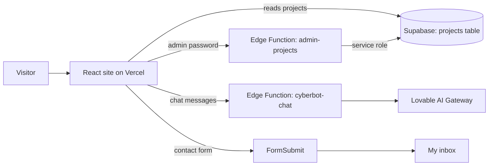

<div align="center">

# Florian G.L · Portfolio v2

**My personal portfolio: projects, skills, AI assistant and mini-games**

🇬🇧 English · [🇫🇷 Français](README.fr.md)

[](https://florian-portfolio-v2.vercel.app/)


</div>

---

## About

This is the source code of my portfolio. I'm a student in the BUT Réseaux & Télécommunications (Networks & Telecoms) programme, cybersecurity track, in Réunion. The site presents my projects, skills and CV, and it also includes an AI assistant and a few mini-games.

This is **version 2**: a complete redesign with a 3D planet on the home page, motion design and a new visual identity. All the content from the [previous version](https://github.com/JLFlo12/florian-portfolio) is kept.

## Features

- 🪐 **Home**: introduction with an interactive 3D planet (dotted continents, network links, ring, beacon on Réunion), technical skills and soft skills, and the tools I use (Kali Linux, Wireshark, GNS3, pfSense, Unreal Engine…) shown as a Jarvis-style 3D hologram ring you can grab and spin
- ✨ **Motion design**: boot-style loading screen, smooth scrolling, 3D text reveals, page transitions, custom cursor and HUD details (disabled when the system asks for reduced motion)
- 📁 **Projects**: projects grouped into *In progress* and *Completed*, with a detail page for each (description, image gallery, Canva slideshow)
- 👤 **About**: education, areas of expertise (networks, systems, cybersecurity) and a CV available as a printable web page (`/cv`, one A4 page) or as a PDF
- ✉️ **Contact**: a contact form (messages are delivered by email through FormSubmit, with a spam trap), plus email, GitHub and LinkedIn
- 🤖 **Jarvis**: an AI assistant that answers questions about my profile, skills and projects, as well as general questions, with streamed replies formatted in Markdown. It stays up to date: the site sends it today's date, the projects from the database and the profile shown on the site
- 🎮 **Games**: Dino Runner, Flappy Bird, Snake, Guess the Building and Tower Crane Challenge
- 🌗 **Dark and light theme**, remembered by the browser
- 🌍 **French and English** (i18next)
- 🔐 **Admin mode**: a password-protected screen to add, edit and delete projects and manage their galleries, directly from the site

## Tech stack

| Area | Technology |
| --- | --- |
| Framework | React 18 + TypeScript |
| Build tool | Vite 5 (SWC) |
| UI | Tailwind CSS, shadcn/ui (Radix UI), lucide-react |
| Animation | GSAP + ScrollTrigger, Lenis (smooth scroll), Framer Motion (mini-games) |
| 3D | three.js + React Three Fiber (home page planet, loaded on demand) |
| Fonts | Hubot Sans, Mona Sans, Geist Mono, Doto, Instrument Serif (self-hosted in `public/fonts`, SIL Open Font License) |
| Routing | React Router 6 |
| Translations | i18next / react-i18next |
| Data | Supabase (PostgreSQL, Storage, Edge Functions) + TanStack React Query |
| AI chatbot | Supabase Edge Function → Lovable AI Gateway (streaming) |
| Contact form | [FormSubmit](https://formsubmit.co) |
| Hosting | Vercel |
| Analytics | Vercel Web Analytics (no cookies) |
| Scaffolding | [Lovable](https://lovable.dev) |

## How it works



- Projects are stored in the Supabase `projects` table. Anyone can **read** them, but only the `admin-projects` Edge Function **writes** to it, after checking the admin password.
- The `cyberbot-chat` Edge Function sends the conversation to the AI model and streams the reply back to the site.

## Getting started

### Prerequisites

- [Node.js](https://nodejs.org/) 18 or later, and npm
- A [Supabase](https://supabase.com) project (to show projects and use the chatbot)

### Installation

```bash
git clone https://github.com/JLFlo12/florian-portfolio-v2.git
cd florian-portfolio-v2
npm install
npm run dev
```

Then open **http://localhost:8080**.

### Environment variables

Front end (`.env` file):

```env
VITE_SUPABASE_URL=https://<project-id>.supabase.co
VITE_SUPABASE_PUBLISHABLE_KEY=<anon key>
VITE_SUPABASE_PROJECT_ID=<project-id>
```

Edge Functions secrets (`supabase secrets set NAME=value`):

| Secret | Used by | Role |
| --- | --- | --- |
| `ADMIN_PASSWORD` | `admin-projects` | Password for admin mode |
| `LOVABLE_API_KEY` | `cyberbot-chat` | Key for the Lovable AI Gateway |

### Database and functions

```bash
supabase link --project-ref <project-id>
supabase db push
supabase functions deploy admin-projects
supabase functions deploy cyberbot-chat
```

### Scripts

| Command | Description |
| --- | --- |
| `npm run dev` | Starts the development server (port 8080) |
| `npm run build` | Builds the production version into `dist/` |
| `npm run preview` | Previews the production build locally |
| `npm run lint` | Runs ESLint |

## Project structure

```
florian-portfolio-v2/
├── public/
│   ├── buildings/             # Images for the "Guess the Building" game
│   ├── portfolio-v1/          # First version of the portfolio (HTML/CSS/JS)
│   └── mon-cv.pdf             # CV
├── src/
│   ├── components/
│   │   ├── admin/             # Admin login, project form, gallery editor
│   │   ├── fx/                # Smooth scrolling, loading screen, custom cursor
│   │   ├── games/             # The 5 mini-games
│   │   ├── three/             # 3D planet on the home page (React Three Fiber)
│   │   ├── Layout.tsx         # Header, navigation, page transitions, theme and language switches
│   │   ├── Footer.tsx         # Footer (contact links, local time in Réunion)
│   │   └── ui/                # shadcn/ui components
│   ├── contexts/              # Theme (dark/light)
│   ├── data/                  # Project galleries, profile, tools and CV (shared with Jarvis)
│   ├── hooks/                 # Admin authentication, projects (React Query)
│   ├── i18n/                  # French and English translations
│   ├── integrations/supabase/ # Supabase client and generated types
│   ├── lib/                   # Animation helpers (GSAP) and utilities
│   └── pages/                 # Home, Projects, About, CV, Contact, Jarvis, Games
├── supabase/
│   ├── functions/             # admin-projects, cyberbot-chat
│   └── migrations/            # projects table, storage bucket
└── vercel.json                # SPA rewrites for Vercel
```

## Deployment

The site is deployed on **Vercel** at [florian-portfolio-v2.vercel.app](https://florian-portfolio-v2.vercel.app/). `vercel.json` sends every route to `index.html`, so links such as `/projects` work when the page is reloaded.

## License

The source code is released under the [MIT License](LICENSE).
Personal content (CV, photos, project descriptions) and third-party images are **not** covered by this license and may not be reused without permission.
